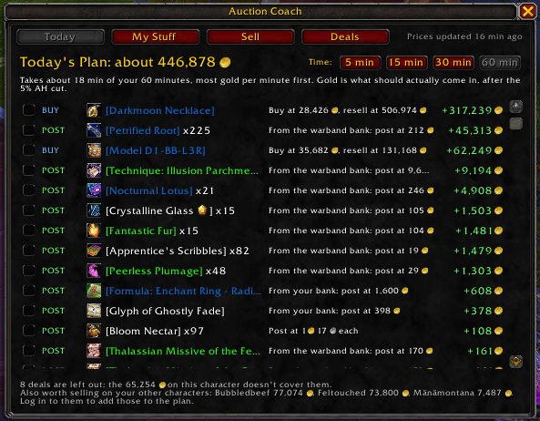
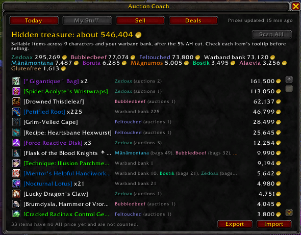
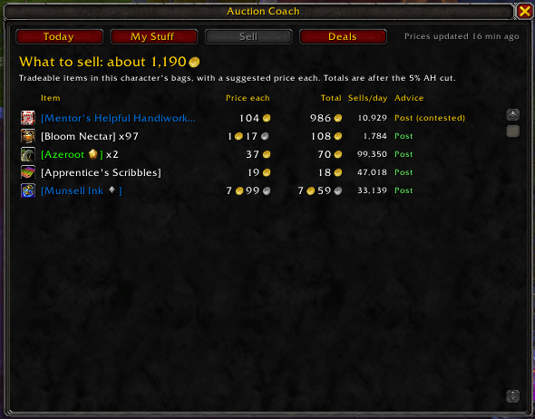
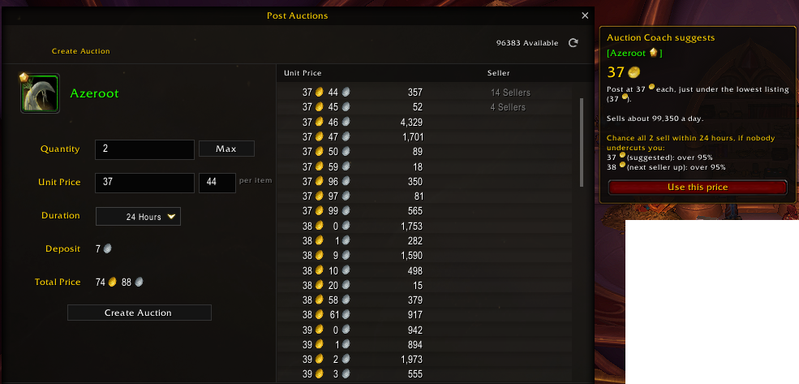
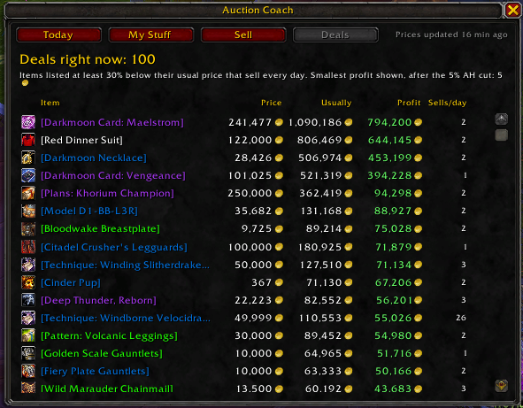

# Auction Coach

**A plain-English Auction House coach for World of Warcraft (Retail).** Auction Coach tells you what your stuff is worth, what to sell, what price to post at and how likely it is to sell. No groups, operations or price formulas to set up.

**It advises and never automates.** You do all the buying, posting and cancelling yourself.

[Download on CurseForge](https://www.curseforge.com/wow/addons/auction-coach) | [Website](https://auctioncoach.ctrlshiftzed.com) | [Report a bug or suggest an idea](https://github.com/VaughanT31/auction-coach-addon/issues/new/choose)

## What it does

### Today's Plan

Got 15 minutes? Pick your time and get a short to-do list, best gold per minute first: what to post (from your bags, bank and warband bank), which undercut listings to repost, which deals you can afford and what to vendor. Each step shows the gold it should actually bring in, after the AH cut. Tick steps off as you go.

### What your stuff is worth

The **My Stuff** tab adds up everything sellable on all your characters and your warband bank, item by item. Most players are surprised by how much is sitting in their banks.

Item tooltips say what an item is worth, how many you have across your characters, whether a vendor pays more and how tough the competition is.

### What to sell, and for how much

The **Sell** tab lists everything in your bags with one suggested price, how fast it sells and whether to post, hold or vendor it. At the Auction House, click a row to put the item in the sell box.

When you put an item in the sell box, the **post helper** suggests a price and shows the chance your stack sells in time. "Use this price" fills it in, and you still click Post.

### Deals

The **Deals** tab lists items listed well below their usual price that sell every day, with your profit after the AH cut. At the AH, click a row to open its listings. Buying is up to you.

### And also

- **Sale messages:** when an auction sells, a chat line says what it made after the AH cut.
- **Undercut timing:** learns how fast each item gets undercut, so you know which ones need watching.
- **Fits how you play:** tell it whether you check the AH rarely, often or constantly (casual, active or camper), and the advice adapts.
- **Grey items:** says to vendor them. Most grey AH listings are gold sellers moving gold, so their AH prices are not real.
- **Vendor and delete protection:** warns before you sell or delete something valuable, and offers to buy it straight back from the vendor.
- **Old price warning:** tells you at login when the desktop app's prices are getting old.

## Install

### 1. The addon

- **[CurseForge](https://www.curseforge.com/wow/addons/auction-coach):** click Install, or search for **Auction Coach** in the CurseForge app.
- **By hand:** download `AuctionCoach-x.y.z.zip` from the [releases](https://github.com/VaughanT31/auction-coach-addon/releases) and unzip it into `World of Warcraft\_retail_\Interface\AddOns`.

Log in, open the Auction House once and Auction Coach scans it. The advice starts straight away. That is all you need: the desktop app below is optional.

### 2. The desktop app (optional, recommended)

The free Windows app sits in the tray and downloads fresh prices every hour, with 14-day averages and sales estimates. These make deals, sell chances and Today's Plan much better.

1. **Download** `AuctionCoachSetup-0.5.0.exe` from the [desktop app release](https://github.com/VaughanT31/auction-coach-addon/releases/tag/desktop-v0.5.0).
2. **Run it.** Windows may say it protected your PC, because the installer is not code signed yet: click **More info**, then **Run anyway**. No admin rights needed.
3. **Pick your WoW folder.** The app usually finds it on its own: click it, then **Continue**.
4. **Pick your realms.** Your characters' realms are ticked for you if you have logged in with the addon before. Check the **Region** (EU or US), tick any others you play, then **Save realms**.
5. **Wait for "Prices are up to date"**, then click **Finish**.
6. **In game, type `/reload`.** The Auction Coach window now says "Prices updated ... ago" at the top right.

From then on the app starts with Windows and keeps prices fresh. WoW loads new prices when you log in or `/reload`. To change settings later, double-click the Auction Coach coin in the Windows tray. To remove it, use Windows **Settings > Apps > Auction Coach**.

**No desktop app?** Type `/ac export` in game, paste it under **My report** on [the website](https://auctioncoach.ctrlshiftzed.com/#/report), then copy the prices string it gives you back into `/ac import`.

## Commands

| Command | What it does |
|---|---|
| `/ac` | Open or close the Auction Coach window |
| `/ac plan` | Open Today's Plan |
| `/ac scan` | Scan the Auction House now (it must be open) |
| `/ac options` | Open the options, including your seller style |
| `/ac help` | List every command |

The minimap button opens the window too. Right click it for the options.

## Questions

**Does it post or buy for me?** No, never. It only gives advice. Every click is yours.

**Do I need the desktop app?** No. The addon works on its own from its own AH scans. The app adds price history and sales estimates, which make the advice much better.

**Which regions work?** EU and US.

**The Auction House scan is slow or does not start.** Blizzard allows one full scan every 15 minutes, shared by all addons. If another auction addon has just scanned, Auction Coach has to wait until the 15 minutes are up. `/ac status` shows what the scanner is doing.

## Roadmap

What is coming, roughly in order. Plans change with feedback, so there are no dates. Got an idea, or want something sooner? [Open an idea](https://github.com/VaughanT31/auction-coach-addon/issues/new/choose) or give an existing one a 👍.

**Now**
- **A new look**, matching the other CtrlShift_Zed addons.
- **Gold overview** on the My Stuff tab: your total gold and each character's gold, beside your hidden treasure.
- **Today's Plan, more steps:** collect your mailbox, repost expired items and cancel listings that will not sell.
- **Cancel or repost:** at the Auction House, see which of your auctions have been undercut and what to do about each one.
- Prices for more realms in both EU and US.

**Next**
- **Gold tracking:** your gold and sales over time, per character and in total.
- **Destroy values:** whether an item is worth more disenchanted, milled or prospected than sold as it is.
- **Shopping list:** items you want, with a note when one is listed below your price.
- **Market calendar** on the website: weekly reset, Darkmoon Faire, holidays and patch days, and what they usually do to prices.
- Auction Coach prices inside popular crafting addons.
- **Cross-realm flips:** items that are cheap on one of your realms and sell for more on another. Buy, move them through the warband bank, post on the other realm.

**Later**
- **Optional accounts** on the website (no Blizzard login needed) so your saved reports follow you to any device, updated by the desktop app.
- **My auctions** on the website: what you have listed, what has been undercut and what has sold.
- **Alerts outside the game** (Discord first): undercut, sold, or a deal on your shopping list.
- Warnings about price manipulation.
- **Craft or sell:** which of your recipes are worth crafting for the Auction House right now, and whether to sell the reagents instead.
- Other languages, a code-signed installer and a macOS desktop app.

Never planned: automatic buying, posting or cancelling, or TSM-style groups and price formulas. Auction Coach advises, you click.

## Support

Auction Coach is free. If it helps you, you can [buy me a coffee](https://ko-fi.com/G2G01YLR68).

Addon developers: Auction Coach can be a price source for your addon, see [Docs/DEVELOPERS.md](Docs/DEVELOPERS.md).

MIT licence, see [LICENSE](LICENSE).
